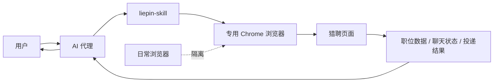

# liepin-skill

一个面向 AI 代理的猎聘自动化技能。

它通过 Chrome `--remote-debugging` 驱动专用浏览器会话，帮助用户在猎聘中完成打招呼、职位检索、查看职位详情、检查投递链路等操作。整个流程基于真实浏览器页面交互，而不是直接伪造站点请求；同时该技能会创建独立的专用浏览器环境，减少对日常浏览器会话、Cookie 和使用上下文的影响。

## 工作方式示意图



这个技能的核心不是“后台偷偷发请求”，而是让 AI 代理在一个独立、可控的专用浏览器里完成真实页面交互，再把结果返回给用户。

## 适合谁

- 想让 AI 代理帮自己在猎聘里完成重复求职操作的人
- 希望把猎聘操作限定在独立浏览器环境中，避免和日常浏览器混用的人
- 需要一个可复用、可维护的浏览器自动化技能，而不是一次性脚本的人

## 可以做什么

- 在猎聘中检索职位并读取当前页面对应的职位数据
- 打开职位详情页，辅助判断是否值得继续沟通或投递
- 在真实页面中执行点击、打开、进入聊天等用户指令
- 配合页面状态和网络请求，确认打招呼、投递等动作是否真的完成
- 在登录失效、调试连接异常、接口变化时，给出明确的恢复路径

## 为什么不是普通自动化脚本

### 1. 更接近真人浏览器操作路径

该技能通过 Chrome 的远程调试能力控制真实浏览器页面，优先依赖页面交互和浏览器内网络流量，而不是绕过页面直接批量伪造请求。对于需要登录态、页面上下文和真实交互链路的场景，这种方式更稳定，也更容易核实每一步是否真的发生。

### 2. 专用浏览器隔离日常环境

该技能会创建独立的浏览器 `profile/` 目录，专门用于猎聘会话。这样做的价值是：

- 降低与日常浏览器账号、Cookie、历史记录混用的风险
- 降低 AI 代理误操作到你日常浏览器标签页的概率
- 让登录态、调试端口和自动化会话保持在一个可控范围内

### 3. 不是只会“点页面”

这个技能不只是点击按钮。它还会结合页面可见状态、网络请求和响应结果，尽量避免“看起来点了，其实没成功”的假成功。

## 使用边界

这个项目不承诺“完全无风控风险”或“绝对安全”。更准确的说法是：

- 它采用的是真实浏览器交互路径，而不是粗暴抓包或直接伪造站点接口
- 它使用的是独立浏览器环境，能降低与日常浏览器混用带来的暴露和串号风险
- 你仍然应该按照平台规则和正常用户意图使用，不要把它用于高频、批量、骚扰式操作

如果你需要的是大规模群发、批量刷投、绕过登录或规避平台规则，这个技能不是为那种场景设计的。

## 快速开始

### 1. 放到本地技能目录

将本目录放到你的本地技能目录中，并设置环境变量：

```bash
export LIEPIN_SKILL_DIR="/你的/liepin-skill/绝对路径"
```

### 2. 确认浏览器调试工具可用

你的 Agent 环境需要能控制 Chrome DevTools。建议使用 Chrome DevTools MCP 或等价的浏览器控制能力。

### 3. 启动专用浏览器

```bash
bash "$LIEPIN_SKILL_DIR/scripts/launch_liepin_chrome.sh"
```

如果需要改调试端口：

```bash
LIEPIN_DEBUG_PORT=9333 bash "$LIEPIN_SKILL_DIR/scripts/launch_liepin_chrome.sh"
```

### 4. 获取调试连接地址

```bash
python3 "$LIEPIN_SKILL_DIR/scripts/print_browser_url.py"
```

### 5. 在专用浏览器中完成登录

首次使用时，请在这个专用 Chrome 窗口里登录猎聘。之后登录态会保存在本地 `profile/` 中，供后续继续复用。

如果调试工具无法接入这个专用浏览器，优先检查三件事：

- Chrome 是否仍然保持打开
- 调试端口是否与 `session.json` 一致
- 你的浏览器控制工具是否真的连接到了这个专用浏览器，而不是另一个空白浏览器实例

必要时直接重启专用浏览器，并重新读取连接地址，通常比在浏览器里手工改调试设置更可靠。

## 典型使用场景

- “帮我看看北京的 Python 岗位，先给我前 10 个结果。”
- “打开这个职位详情，判断一下值不值得投。”
- “进入聊天页，帮我确认刚才的招呼语是不是真的发出去了。”
- “如果能投简历就继续，如果只是 `聊一聊` 就告诉我不要算作投递成功。”

## 三条最常见指令示例

下面这三类请求最适合作为这个技能的起手式：

```text
帮我在猎聘里找上海产品经理岗位，先整理前 10 个结果。
```

```text
打开这个职位详情页，帮我判断一下值不值得继续聊。
```

```text
如果这个岗位可以投简历就继续操作，并告诉我是否真的投递成功。
```

## 项目结构

- [SKILL.md](./SKILL.md)：技能主体说明，定义触发条件、工作流和边界
- [scripts/launch_liepin_chrome.sh](./scripts/launch_liepin_chrome.sh)：启动并维护专用 Chrome 会话
- [scripts/print_browser_url.py](./scripts/print_browser_url.py)：读取 `session.json` 并输出调试连接地址
- [evals/evals.json](./evals/evals.json)：回归评测样例，用于后续维护时防止能力退化

## 本地运行态说明

以下内容是本地运行态，不属于对外发布内容：

- `profile/`
- `session.json`
- `chrome-launch.log`

这些文件已经通过 [.gitignore](./.gitignore) 排除，不应被提交、打包或分享。

## 常见问题

### 1. 它会不会影响我日常使用的 Chrome？

正常情况下不会。这个技能会创建独立的 `profile/` 目录，专门用于猎聘自动化，不应该和你平时使用的浏览器资料混在一起。

### 2. 为什么一定要用专用浏览器？

因为猎聘这类场景依赖真实登录态、页面上下文和连续交互。专用浏览器能减少串号、误操作和上下文混用，也更容易确认 AI 代理控制的是哪一个会话。

### 3. 这个方案是不是“绝对安全”或者“绝对不会被风控”？

不是。更准确的说法是：它更接近真实浏览器交互路径，并且比粗暴抓包或接口伪造更可控，但你仍然需要按照平台规则和正常用户意图使用。

### 4. 为什么仓库里还保留 `evals/`？

因为它是维护这个技能的质量护栏。以后你改 `SKILL.md` 或脚本时，可以用这些样例检查关键行为有没有退化，比如登录失效处理、`Preflight` 识别、启动失败恢复等。

### 5. 如果调试连接失败怎么办？

先不要怀疑猎聘页面本身，先检查这几件事：

- 专用 Chrome 是否仍然保持打开
- `session.json` 里的端口是否和实际连接端口一致
- 你的浏览器控制工具是否连到了专用浏览器，而不是另一个空白实例

大多数情况下，重启专用浏览器并重新读取连接地址就能恢复。

## 维护建议

如果你后续会继续迭代这个技能，建议保留 `evals/`。它不是运行必需，但能帮助你在修改 `SKILL.md` 或脚本后快速检查关键行为有没有退化，比如：

- 登录失效时是否会停下来等待用户
- 是否错误把 `Preflight` 当成真实职位数据
- 浏览器启动失败时是否会给出明确恢复路径

## 许可证与使用原则

请在遵守猎聘平台规则、账号授权范围和正常求职意图的前提下使用本项目。这个技能的目标是帮助用户以更稳定、更可控的方式完成真实浏览器内的求职操作，而不是规避平台规则。
