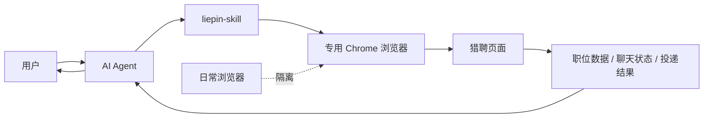

# liepin-skill

一个面向 AI Agent 的猎聘自动化 Skill。

它通过 Chrome `--remote-debugging` 驱动专用浏览器会话，帮助用户在猎聘中完成打招呼、职位检索、查看职位详情、检查投递链路等操作。整个流程基于真实浏览器页面交互，而不是直接伪造站点请求；同时该 Skill 会创建独立的专用浏览器环境，减少对日常浏览器会话、Cookie 和使用上下文的影响。

## 直接安装

```bash
npx skills add NOime22/liepin-skill -g -y
```

## 工作方式示意图



这个 Skill 的核心不是“后台偷偷发请求”，而是让 AI Agent 在一个独立、可控的专用浏览器里完成真实页面交互，再把结果返回给用户。

## 适合谁

- 想让 AI Agent 帮自己在猎聘里完成重复求职操作的人
- 希望把猎聘操作限定在独立浏览器环境中，避免和日常浏览器混用的人
- 需要一个可复用、可维护的浏览器自动化 Skill，而不是一次性脚本的人

## 可以做什么

- 在猎聘中检索职位并读取当前页面对应的职位数据
- 打开职位详情页，辅助判断是否值得继续沟通或投递
- 在真实页面中执行点击、打开、进入聊天等用户指令
- 配合页面状态和网络请求，确认打招呼、投递等动作是否真的完成
- 在登录失效、调试连接异常、接口变化时，给出明确的恢复路径

## 为什么不是普通自动化脚本

### 1. 更接近真人浏览器操作路径

该 Skill 通过 Chrome 的远程调试能力控制真实浏览器页面，优先依赖页面交互和浏览器内网络流量，而不是绕过页面直接批量伪造请求。对于需要登录态、页面上下文和真实交互链路的场景，这种方式更稳定，也更容易核实每一步是否真的发生。

### 2. 专用浏览器隔离日常环境

该 Skill 会创建独立的浏览器 `profile/` 目录，专门用于猎聘会话。这样做的价值是：

- 降低与日常浏览器账号、Cookie、历史记录混用的风险
- 降低 AI Agent 误操作到你日常浏览器标签页的概率
- 让登录态、调试端口和自动化会话保持在一个可控范围内

### 3. 不是只会“点页面”

这个 Skill 不只是点击按钮。它还会结合页面可见状态、网络请求和响应结果，尽量避免“看起来点了，其实没成功”的假成功。

## 使用边界

这个项目不承诺“完全无风控风险”或“绝对安全”。更准确的说法是：

- 它采用的是真实浏览器交互路径，而不是粗暴抓包或直接伪造站点接口
- 它使用的是独立浏览器环境，能降低与日常浏览器混用带来的暴露和串号风险
- 你仍然应该按照平台规则和正常用户意图使用，不要把它用于高频、批量、骚扰式操作

如果你需要的是大规模群发、批量刷投、绕过登录或规避平台规则，这个 Skill 不是为那种场景设计的。

## 快速开始

### 1. 安装 Skill

```bash
npx skills add NOime22/liepin-skill -g -y
```

### 2. 确认 Agent 环境具备 Chrome 控制能力

你的 Agent 环境需要能控制 Chrome DevTools。建议使用 Chrome DevTools MCP 或等价的浏览器控制能力。

### 3. 直接向 Agent 下达任务

正常使用时，专用 Chrome、调试连接地址、会话复用和页面检查都应该由 Skill 自己处理。你只需要向 Agent 提出任务，例如：

```text
帮我在猎聘里找上海产品经理岗位，先整理前 10 个结果。
```

如果首次启动后 AI Agent 发现还无法接管这个专用 Chrome，它应该先停下来，明确告诉你在这个专用浏览器里打开 `chrome://inspect/#remote-debugging`，手动开启 `remote-debugging`，关闭该标签页，然后回来告诉 AI “好了” 再继续。

首次使用时，如果 Skill 检测到尚未登录，会提示你在专用 Chrome 窗口中手动完成登录。之后登录态会保存在本地 `profile/` 中，供后续继续复用。

### 4. 只有在手动接线或排障时，才需要关心脚本

大多数用户不需要手动执行这些脚本。它们主要用于：

- 手动排查专用 Chrome 是否正常启动
- 手动读取当前调试连接地址
- 在自定义 Agent 环境中调试接入方式

## 常见指令示例

下面这些示例更接近真实求职需求，也更适合作为你在 Agent 中直接使用的指令模板。

### 1. 按多条件筛职位

```text
帮我用 liepin-skill 在猎聘里找岗位，优先看上海、深圳、北京；行业优先金融、资产管理、投资、互联网、AI、科技、大厂、外企；目标岗位是数据产品、数据分析、运营、商业分析、BI、BA、产品、金融产品、AI 产品、投资顾问、用户研究；月薪大于 20k，先给我当前推荐里最相关的 20 个结果。
```

### 2. 批量打招呼但不投递

```text
帮我在猎聘里只打招呼不投递，从当前推荐里筛出和以下要求最相关的 10 个岗位后依次打招呼：城市优先上海、深圳、北京；行业优先金融、互联网、AI、科技；岗位方向是数据产品、数据分析、商业分析、运营、产品。
```

### 3. 有条件地继续聊

```text
进入这个职位详情页，先判断是否符合我的方向；如果合适就继续聊，不合适就告诉我为什么不建议继续。
```

### 4. 只统计真实投递成功

```text
帮我处理当前这批岗位：如果可以投简历就继续操作；如果只是“聊一聊”或“继续聊”，不要算作投递成功。最后只汇总真正投递成功的岗位给我。
```

### 5. 带排除条件筛选

```text
帮我在猎聘里找产品相关岗位，优先城市是上海和深圳；排除医药、医疗、保险、制造、教育；也排除医生、销售、教师、会计、财务、审计、风控、算法、开发工程师这类关键词，先整理出最值得看的 15 个结果。
```

### 6. 复核聊天是否真的发出

```text
进入聊天页，帮我确认刚才的招呼语是不是已经真实发出；如果没有发出去，告诉我卡在哪一步。
```

### 7. 检查职位是否值得投

```text
打开这个职位详情，结合岗位职责、要求、薪资和公司背景，帮我判断值不值得投，并给出简短理由。
```

### 8. 先筛选，再投递

```text
先从当前推荐列表里筛出最符合我要求的岗位，再逐个检查是否支持投简历；只对真正支持投递的岗位继续操作，并汇总结果。
```

## 项目结构

- [SKILL.md](./SKILL.md)：Skill 主体说明，定义触发条件、工作流和边界
- [scripts/launch_liepin_chrome.sh](./scripts/launch_liepin_chrome.sh)：启动并维护专用 Chrome 会话
- [scripts/print_browser_url.py](./scripts/print_browser_url.py)：读取 `session.json` 并输出调试连接地址
- [evals/evals.json](./evals/evals.json)：回归评测样例，用于后续维护时防止能力退化

## 本地运行态说明

以下内容是本地运行态，不属于对外发布内容：

- `profile/`
- `session.json`
- `chrome-launch.log`

这些文件已经通过 [.gitignore](./.gitignore) 排除，不应被提交、打包或分享。

## 常见问题

### 1. 它会不会影响我日常使用的 Chrome？

正常情况下不会。这个 Skill 会创建独立的 `profile/` 目录，专门用于猎聘自动化，不应该和你平时使用的浏览器资料混在一起。

### 2. 为什么一定要用专用浏览器？

因为猎聘这类场景依赖真实登录态、页面上下文和连续交互。专用浏览器能减少串号、误操作和上下文混用，也更容易确认 AI Agent 控制的是哪一个会话。

### 3. 这个方案是不是“绝对安全”或者“绝对不会被风控”？

不是。更准确的说法是：它更接近真实浏览器交互路径，并且比粗暴抓包或接口伪造更可控，但你仍然需要按照平台规则和正常用户意图使用。

### 4. 安装后文件会放到哪里？

通过 `npx skills add NOime22/liepin-skill -g -y` 安装时，Skills CLI 会把这个 Skill 安装到全局 skills 目录。实测默认会落到 `~/.agents/skills/liepin-skill`。普通使用者不需要手动管理这个目录，也不需要自己复制仓库内容。

### 5. 为什么安装命令和仓库地址是同一个？

因为 `skills` CLI 支持直接把 GitHub 仓库当作 Skill source。`NOime22/liepin-skill` 既是仓库地址的一部分，也是安装器识别 source 的标准写法。

### 6. 安装后还需要手动配置 `LIEPIN_SKILL_DIR` 吗？

普通通过 Skills CLI 安装的用户通常不需要。只有在你本地直接开发这个仓库、手动调试脚本、或者自定义 Agent 接入方式时，才可能需要显式设置这个环境变量。

### 7. 为什么仓库里还保留 `evals/`？

因为它是维护这个 Skill 的质量护栏。以后你改 `SKILL.md` 或脚本时，可以用这些样例检查关键行为有没有退化，比如登录失效处理、`Preflight` 识别、启动失败恢复等。

### 8. 如果调试连接失败怎么办？

先不要怀疑猎聘页面本身，先检查这几件事：

- 专用 Chrome 是否仍然保持打开
- `session.json` 里的端口是否和实际连接端口一致
- 你的浏览器控制工具是否连到了专用浏览器，而不是另一个空白实例

大多数情况下，重启专用浏览器并重新读取连接地址就能恢复。

## 维护建议

如果你后续会继续迭代这个 Skill，建议保留 `evals/`。它不是运行必需，但能帮助你在修改 `SKILL.md` 或脚本后快速检查关键行为有没有退化，比如：

- 登录失效时是否会停下来等待用户
- 是否错误把 `Preflight` 当成真实职位数据
- 浏览器启动失败时是否会给出明确恢复路径

## 许可证与使用原则

请在遵守猎聘平台规则、账号授权范围和正常求职意图的前提下使用本项目。这个 Skill 的目标是帮助用户以更稳定、更可控的方式完成真实浏览器内的求职操作，而不是规避平台规则。
